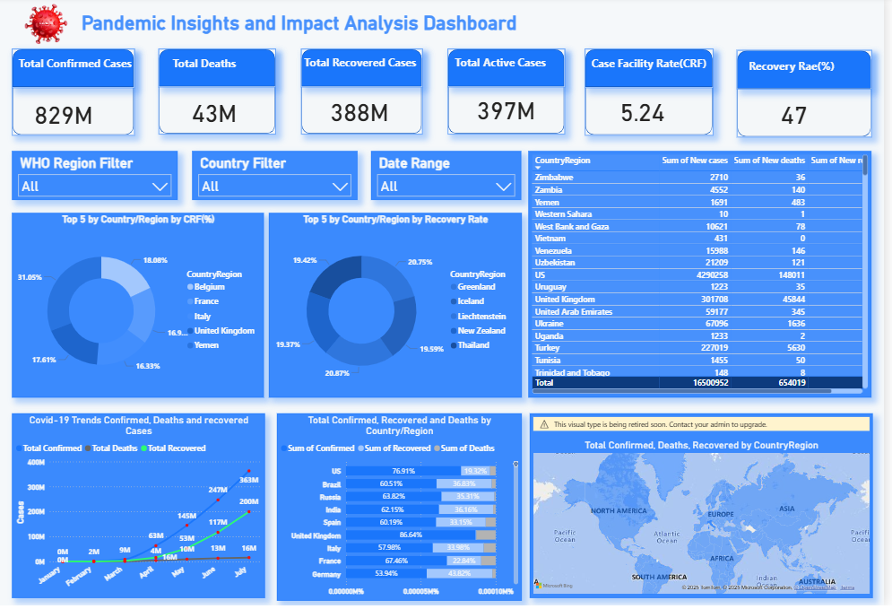

🦠 COVID-19 Global Dashboard (Power BI)

## 📊 Executive Summary
This Power BI dashboard visualizes global COVID-19 data across key metrics — Confirmed Cases, Deaths, and Recoveries — with interactive maps, KPI cards, and trend visuals. Designed for executive audiences, it enables rapid insights into country-level impact, recovery trends, and fatality rates.

---

## 🎯 Objectives
- Track the spread of COVID-19 globally by country, showing Confirmed, Deaths, and Recovered cases.
- Enable dynamic analysis through slicers and filters, allowing users to focus on specific metrics, countries, or time periods.
- Provide clear visual insights with maps, charts, and trend lines to identify patterns, hotspots, and recovery rates.

---

## 📊 Dashboard Features
🔹 KPI Cards
🔹 Filled Map
🔹 Line Chart
🔹 Clustered Stacked Chart
🔹 Donut Chart

---

## 🛠 Tools & Technologies
- Power BI Desktop DAX (Data Analysis Expressions) for KPIs & calculations.
- CSV file as the data source.

---

## 📌 Tooltip Strategy (Power BI)
Visual includes dynamic tooltips with:
- CountryRegion
- Confirmed
- Death
- Recovered
Tooltips are designed to enhance user understanding without cluttering the visuals.

---

## 🧭 Conclusion
This COVID-19 dashboard demonstrates the power of data storytelling through interactive visuals, robust DAX modeling, and executive-level design. By transforming raw case data into dynamic maps, KPI cards, and trend lines, the project delivers actionable insights across countries and metrics.
---

## 📸 Dashboard Preview

---

## 📢 Author
Created by **[Girish Kumar V](https://github.com/GirishKumarV25)** – Passionate about **data analytics, visualizations**.

